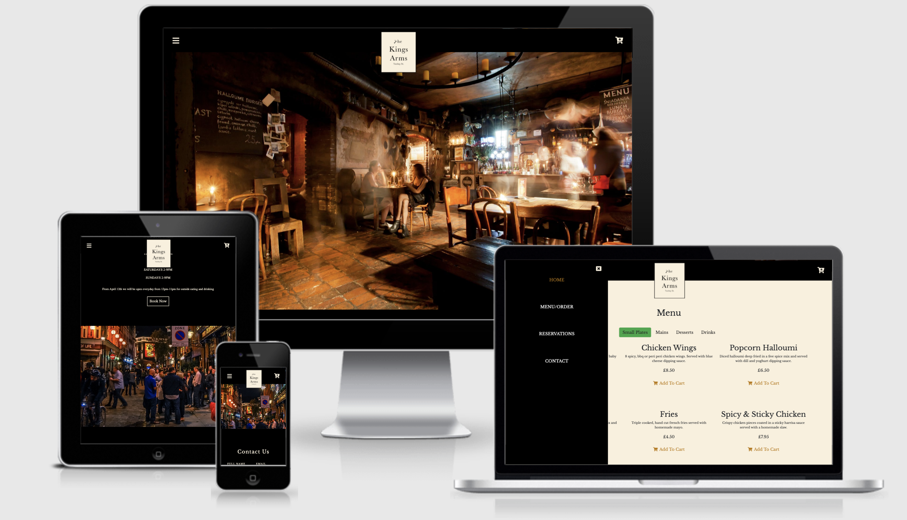
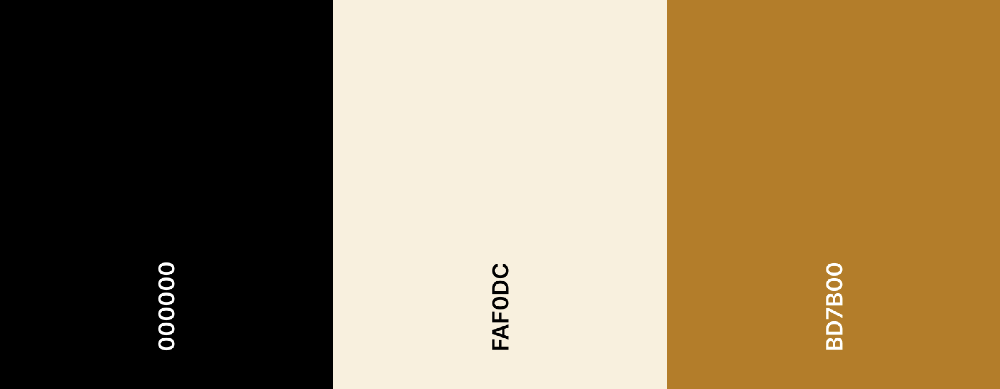

# The Kings Arms, Tooley St.
### A fully interactive booking and ordering site for the Kings Arms, located in London.



[Website Link](https://connorgray97.github.io/the_kings_arms/)


---
# Table of contents

[UX](#UX)

[Design](#design)

[Wireframes](#Wireframes)

[Technologies Used](#tech-used)

[Testing](#testing)

[Bug fixes and known bugs](#bug-fixes)

[Deployment](#deployment)

[Credits](#credits)


# Project Overview

<a name="UX"></a>
# UX 

## Strategy
The Strategy of the Kings Arms site is to increase the amount of potential bookings and to implement an online ordering menu to make it easier for the pub
to comply with the current distancing rules.

---

## Scope
The sites main aim is to make it easier for customer and staff to maintain distancing rules by supplying an online ordering system. Therefore the site will need to be simple and intuitive, whilst maintaining a good UX in order to still attract potential future customers.

## User stories
### Visitor goals
1. As a visitor, I want to immediately understand the sites purpose.
2. As a visitor, I want to be able to browse the venues food options to see if would like to make the visit.
3. As a visitor, I want to be able to easily contact the venue through the site, whether that be to submit feed back or make a request and be informed my email or mobile, that my message was recieved.
4. As a visitor, I want to get a good understanding of what my the atmosphere is like at the venue maybe through images or relevant information.
5. As a visitor, I want to be able to order food from the site to reduce the amount of time in contact with the staff to abide by the current distancing rules.
6. As a visitor, I want to be able to make a booking via the site and have email confirmation sent me once complete.

### Owner goals
1. As the owner, I would like to portray the postitve vibrant atmosphere we have here through our site, whilst keeping it straight forward to use. This can be through images or relevant information.
2. As the owner, I want customers to be able to reach us easily through the site via email and for the site to supply us with the customer contact details, including mobile if they prefer.
3. As the owner, I would like to inform the customers that we would be happy to arrange delivery if they contacted us via telephone.
4. As the owner, I would like to display clearly our location and relevant contact information.

<a name="design"></a>
## Design
### Colour Scheme




### Typography

- I've decided to keep the typography simple for this site, by going for only one typface throughout using the heading hierachy to create variations in the text. The typeface will be [font-family: 'Libre Baskerville', serif;]. It's a nice and simple typeface that gets the point across nicely and doesn't look too busy on the page.

## Skeleton

### Section 1 - Hero Image/Homepage 
- Fixed position nav bar on the top of the page with a shopping cart to the right and nav bars to the left. With the pubs logo in the middle slightly overlapping the hero image or video.
- A hero image or video taking up the whole viewport height that clearly indicates what the site is about.

### Section 2 - Reservation section
- Page includes information about opening times.
- Page also includes a button that opens a modal, that allows the user to fill in a booking form.


### Parallax imagery
- Between each section of the sight I plan to have parallax imagery to divide each section and break up the plain blocks of colour for a better UX.

### Section 3 - Menu 
- I've made some changes since the initial wireframes. Insead of having the menu links direct you to a different page with the whole menu, I decided to 
keep it as a single page site and when you reach the menu section there is toggle button just below the section header. This allows the user to toggle between each menu course.
- This section allow users to browse the full menu and add each item to a shopping cart if need be.

### The Shopping Cart
- This will be hidden on page load. To be accessed there will be a shopping cart icon displayed on the top right that will translateX to make the cart visible. Istead of toggle function I will have 
both, the cart icon and a close icon as the cart will be 100vh.

### The Booking modal
- This will be a small window that appears once the book now button is clicked.

<a name="Wireframes"></a>
## Wireframes

[Mobile Wireframe](https://xd.adobe.com/view/7044415e-af6a-43d1-b4d3-5e220cfe1c4b-2517/)
---
[Tablet Wireframes](https://xd.adobe.com/view/d85f9260-cd6a-4fea-9a81-b7f99e50fb76-8d0c/)
---
[Desktop Wireframes](https://xd.adobe.com/view/7a1f421b-7a42-481b-a0fb-4e88bbe42a55-2f4c/)
---

### Changes since original wireframes

- Instead of a seperate pages to display the menu I opted for the option to toggle between each menu course. This increased performance and made it a slight better UX.
- The logo is located in the center of the site at the top instead of to the left. I felt this suited the style of the logo better.


---

<a name="tech-used"></a>
# Technologies Used
### Languages Used

-  [HTML5](https://en.wikipedia.org/wiki/HTML5)

-  [CSS3](https://en.wikipedia.org/wiki/Cascading_Style_Sheets)

-  [JavaScript](https://en.wikipedia.org/wiki/JavaScript)

### Programs & Frameworks used

[Google Fonts:](https://fonts.google.com/)

- Google fonts, Libre Baskerville was used throughout the project with sans-serif set as the backup. Linked in the head of the project to increase loading times.

[Bootstrap 4.0.0:](https://getbootstrap.com/docs/4.0/)

- Only small amount of Bootstrap was used for the menu toggle buttons. Decided to go pretty custom with the whole site.

[Font Awesome](https://fontawesome.com/)

- Font Awesome was used for the social icons in the contact form and the navigation icons.

 [jQuery:](https://jquery.com/)

- jQuery was used for the navbar toogler and dropdown menu.

[Git](https://git-scm.com/)

- Git was used for version control by utilizing the CLI to push and commit to GitHub.

[GitHub:](https://github.com/)

- GitHub used to store the code.

[AdobeXD](https://www.adobe.com/uk/products/xd.html)

- Adobe XD was used to produce the wireframes and Mockups for the project.

[Jpeg Optimizer](http://www.jpeg-optimizer.com/)

- I used this jpeg optimizer to compress all the imagery to help with performance results.

[EmailJs](https://www.emailjs.com/)

- Was used to iplement the email function on the contact form and booking form on the site.

<a name="testing"></a>
# Testing 

### Code validation

Checking for any Syntax errors was done using the W3C HTML5 and CSS3 validators.

-  [W3C Markup Validator](https://validator.w3.org) - After these [fixes](https://github.com/ConnorGray97/the_kings_arms/commit/cf7a9a5b06c67194eb3cba5a5067303d1c717f7c) the validator display no errors.

-  [W3C CSS Validator](https://jigsaw.w3.org/css-validator/#validate_by_input) - This one did throw up some errors but upon testing on multiple devices and screen sizes the issues pulled up by the validator seemed to not be an issue.

-  [JsHint](https://jshint.com/) - Threw up some issues however they don't seem to be affecting the overall performance of the site too much.

### Lighthouse in dev tools
 lighthouse in dev tools was used extensively throughout this project to make sure everything was logging to the console correctly.

---

### Devices tested on throughout
- Iphone 11
- samsung S8 edge
- Nokia 6.1 plus
- Mac Desktop 
- MacBook pro 16" & 13"
- Sony Vaio
- Ipad mini
- and all of the device emulations on the Chrome dev tools.
---


### Functionality Testing
- #### Navigation bar
    - Nav bar collapses correctly on various screen sizes and devices 
    - Once the nav link is clicked the navigation list collapses as expected.
- #### Parallax images
    - Parallax images work on the majority of media screen sizes however on some iphone devices the effect wouldn't work. This didn't affect the functionality all and didnt ruin the aesthetic.
- #### The Shopping Cart
    - Calculates the total of the item located in the cart correctly.
    - Input field allows you to increase or decrease the item quantity in the cart and updates the total accordingly.
    - Once Checkout is clicked the the alert to inform the customer that online payments are currently unavailable shows up as expected.
- #### Contact form
    - All inputs fields are require and pull up a message saying so.
    - EmalJs is correctly implemented and an email is sent to both customer and owner. This was tested using multiple email addresses.
- #### Menu Section 
    - Menu toggles between courses as expected as expected.
    - Add to cart buttons work as expected.
    - The CSS grid responds correctly to smaller screen sizes, this was tested on mulitple devices stated above.
- #### The Booking Modal
    - Appears from the top of the screen once the book now button is clicked
    - All input fields are required
    - Both the customer and owner recieve an email to notify them that a booking has been made.
- #### The Footer
    - Icludes the contact details and all social links direct you to the correct corresponding location.

---

### Cross Browser Testing

Faced a minor issue along the way with the nav bar and the shopping cart when on different browser. Managed to fix by using a different attribute to execute a function - [Issue Fix](https://github.com/ConnorGray97/the_kings_arms/commit/42f3e36bb87629335854748559f83041711d9397)

#### Google Chrome
- Mobile - All working as expected
- Tablet - All working as expected
- Desktop - All working as expected
#### Opera 
- Mobile - All working as expected
- Tablet - All working as expected
- Desktop - All working as expected
#### Microsoft Edge 
- Mobile - All working as expected
- Tablet - All working as expected
- Desktop - All working as expected
#### Firefox
- Mobile - All working as expected
- Tablet - All working as expected
- Desktop - All working as expected
#### Safari
- Mobile - All working as expected
- Tablet - All working as expected
- Desktop - All working as expected

## Testing User Stories

### Visitor goals
1. As a visitor, I want to immediately understand the sites purpose.

   i. The user is immediately met with a large hero image of the venue, with its logo lacated at the top center of the screen.

2. As a visitor, I want to be able to browse the venues food options to see if would like to make the visit.

   i. By either scrolling to the bottom or using the supplied nav bar the user can then view the food menu and toggle through each menu course wihtout having to navigate mulitple pages. [Screen Shot](./assets/docs/testing/user-story-one.jpg)

3. As a visitor, I want to be able to easily contact the venue through the site, whether that be to submit feed back or make a request and be informed my email or mobile, that my message was recieved.
   
   i. By either scrolling using the supplies navigation link the user can fill out a contact from. [Screen Shot](./assets/docs/testing/user-three-2.jpg)
   
   ii. emailJs has been correctly implemented. Both the owner and user recieved the template emails as expected. [Screen Shot](./assets/docs/testing/user-three.jpg)

4. As a visitor, I want to get a good understanding of what my the atmosphere is like at the venue maybe through images or relevant information.

   i. As the user scrolls down the site i've used parallax imagery that portrays the pubs atmosphere and gives a good idea to the user what is't like.

5. As a visitor, I want to be able to order food from the site to reduce the amount of time in contact with the staff to abide by the current distancing rules.
  
   i. The user is able to add all the items they want to a shopping cart and send the order to the owner wihtout the need for contact. [Screen Shot](./assets/docs/testing/user-four.jpg)

6. As a visitor, I want to be able to make a booking via the site and have email confirmation sent me once complete.
 
   i. A booking modal is supplied when the book now button is clicked. [Screen Shot](./assets/docs/testing/user-six.jpg)

   ii. emailJs has been correctly implemented. Both the owner and user recieved the template emails as expected. [Screen Shot](./assets/docs/testing/user-three.jpg)

  

    

<a name="bug-fixes"></a>

### Bug Fixes
- I was having some issues with the nav and modals on different media screens because I was using attributes with compatibility issues - [Bug Fix](https://github.com/ConnorGray97/the_kings_arms/commit/156cad2f7ac5bb8b8ac92a97b9eba98b3e930604)

- My cart was't checking out when the purchase was clicked - [Bug Fix](https://github.com/ConnorGray97/the_kings_arms/commit/267d3670b7ba57606a03fa1e6fadc7dbaa58f13e)

- I had told the script to remove the dollar signs as opposed to the british pounds sign, so what the array was recieving was not a number - [Bug Fix](https://github.com/ConnorGray97/the_kings_arms/commit/55084b018a4aa41a5ac215985df6111fd501ccdc)

### Known Bugs

- Parallax scroll does not work on some media screen sizes but doesn't affect the aesthetic too much. 

- Ocassionally the checkout alert has to be clicked multiple times in order fot it to close. I wasn't entirely sure how to go about fixing this.

<a name="deployment"></a>
# Deployment

### GitHub Pages

GitHub pages was used to deploy the site...

1. Log in to GitHub and find the [the_kings_arms repository.](https://github.com/ConnorGray97/the_kings_arms)

2. Inside the repository, click on the settings button inside the menu.

3. Scroll down the Settings page until you locate the "GitHub Pages" Section.

4. In the "source" section change the dropdwon from none to "master branch" and hit save.

5. The page will automatically refresh.

6. Scroll back down through the page to locate the now published site in the "GitHub Pages" section.

### Forking the GitHub Repository

  Forking a repository is making a copy that can have changes made to it without affecting the original copy, these are the steps:

  
1. In GitHub locate [the_kings_arms repository](https://github.com/ConnorGray97/Sienna-Website)

2. At the top of the Repository locate the "Fork" Button.

3. There will now be a copy of the repository in your git GitHub account.

### Making a Local Clone

1. Log in to GitHub and locate the [the_kings_arms](https://github.com/ConnorGray97/the_kings_arms) repository.
2. Under the repository name, click "Clone or download".
3. To clone the repository using HTTPS, under "Clone with HTTPS", copy the link.
4. Open Git Bash
5. Change the current working directory to the location where you want the cloned directory to be made.
6. Type `git clone`, and then paste the URL you copied in Step 3.

```
$ git clone https://github.com/ConnorGray97/the_kings_arms/
```

7. Press Enter. Your local clone will be created.

```
$ git clone https://github.com/ConnorGray97/the_kings_arms/
> Cloning into `CI-Clone`...
> remote: Counting objects: 10, done.
> remote: Compressing objects: 100% (8/8), done.
> remove: Total 10 (delta 1), reused 10 (delta 1)
> Unpacking objects: 100% (10/10), done.
```

Click [Here](https://help.github.com/en/github/creating-cloning-and-archiving-repositories/cloning-a-repository#cloning-a-repository-to-github-desktop) to retrieve pictures for some of the buttons and more detailed explanations of the above process.

<a name="credits"></a>
# Credits

## Content

- I used Code institutes [sample README.md](https://github.com/Code-Institute-Solutions/SampleREADME) as inspiration for my own.

## Media

- Althought a ficticious site, many thanks to the King arms for allowing me to use their details and logo.
- Parallax images were taken from shutterstock

## Code

- I adapted this contact form styling from [Code Pen](https://codepen.io/dfitzy/pen/VepqMq) to suit my own site.

- Credits to Web Dev Simplified for parts of the shopping cart [Link](https://www.youtube.com/watch?v=YeFzkC2awTM&t=9s)

- Credits to FreeCodeCamp.org for parts of the cart also [Link](https://www.youtube.com/watch?v=023Psne_-_4&t=2432s)

# Acknowledgements

- Massive thanks to my mentor Maranatha for the help and support.
- Thank you to the amazing community on slack for all the help when needed.